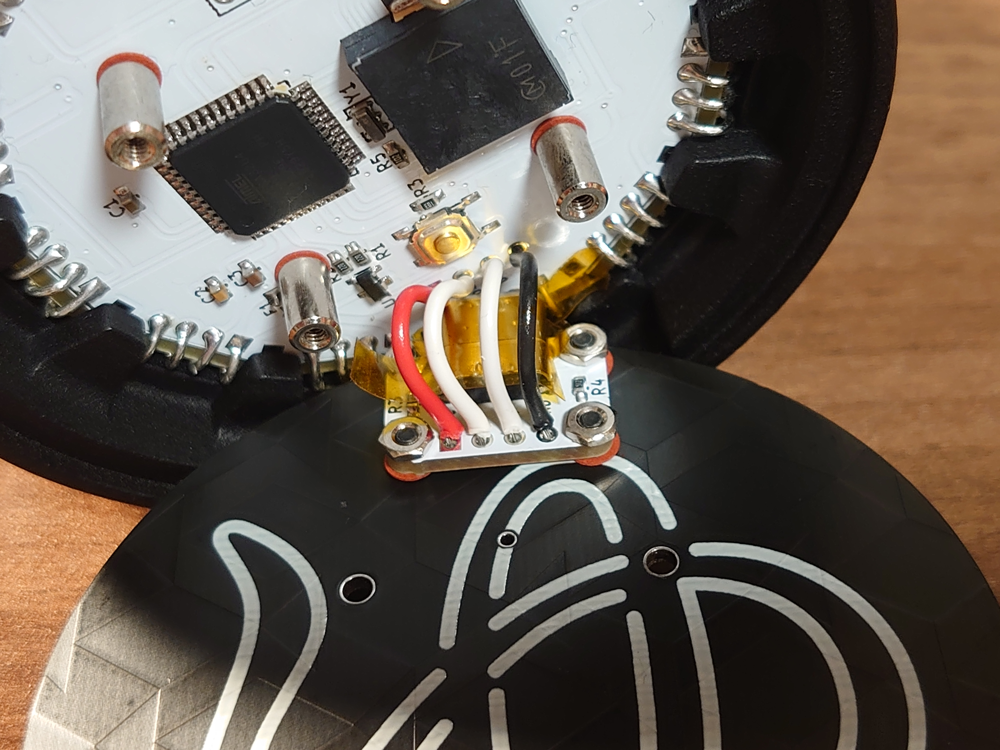

# Gboard 湯呑みバージョン ◤◢◤◢◤◢◤◢カスタム

## 0. 事前準備
### 事前準備物

- キーキャップ
- 温調ハンダごて
- ハンダ
- テスタ
- 丸ヤットコ
- 先細ペンチ
- ハンダメッキ線 もしくは スズメッキ線
- カプトンテープ
- テストワイヤ
  - [スルーホール用テストワイヤ TP-200 (10本入)](https://akizukidenshi.com/catalog/g/gC-09830/)
- ジグ
  - [mozc-devices/jig.stl at master · google/mozc-devices](https://github.com/google/mozc-devices/blob/master/mozc-yunomi/jig.stl)
- Kailh Choc キーキャップ x 60
  - Kailh公式のキーキャップとMBKプロファイルのみ取り付け確認済み
- USBケーブル

### 前提知識

　以下の本家リポジトリの内容を熟読して、差分を把握ください。

[mozc-devices/mozc-yunomi at master · google/mozc-devices](https://github.com/google/mozc-devices/tree/master/mozc-yunomi/)

　本家からの主な変更点はいかのとおりです。

- LEDの追加
- スピーカの追加
- 上下キーピッチの短縮
- 実装をすべて表面実装に変更
- ケースの独自設計

　螺旋状に構成された倍マトリクスの構造を事前に理解した状態で組み立てを開始してください。
PCB上のパターンをテスタで追いかけ、キーマトリクスがどのように構成されるかを以下の図を参考にしながら確認してください。
パターン上での本家からの変更点は、使用していないROWのピン(1番のPCB)をLEDの信号を通すために使用しています。
LEDの信号は同様に使用していないPCBの左右間接続の一部を使用しています。
12本すべて同一のPCBのためジャンパで本来のROWピンをROWとして用いるかLEDとして用いるか振り分けています。

## 1. ダイオードとLEDの実装

　ダイオードとLEDを実装します。
ダイオードの向きは以下の図の通りにしてください。
重複している対となるCOLで向きが反転します。
LEDは実装後に点灯テストを行ってください。
点灯テストでは5個目のLEDが次のPCBへ適切に信号を送れているかも確認してください。
LED数を10で定義したファームウェアをQMKで作成してテストを行うと楽です。

## 2. ジャンパのショート

　各ジャンパを適切にショートさせてキーマトリクスとLEDの信号が伝わる回路を完成させます。
キーマトリクスの構成に対する理解が正しいか今一度確認しながら進めてください。

## 3. PCB同士の接続1

　PCB同士を接続し円筒状にします。
丸ヤットコを使いハンダメッキ線などをアルファベットのCの形状に加工して接続に用います。

　一旦3本ずつの組を作るよう接続すると作業しやすいです。
接続の際にはジグを必ず使用してきれいな正十二角形になるようにしてください。

|||
|:---:|:---:|

　3本と3本を接続して6本で構成された半円筒にしたあと、最後に円筒になるよう作業が楽です。
ここまで作業を進めると後戻りできないため再度確認しつつ進めてください。

|||
|:---:|:---:|

　底面になる部分は外側からハンダメッキ線などを通して内側に出っ張らないようにしてください。

　適宜ケースに取り付けながら様子を見て作業を進めてください。

## 4. PCB同士の接続2

　底面となるPCBを取り付けます。

|||
|:---:|:---:|
|||

## 5. ケースの取り付け

　ケースを取り付けます。
USB端子部分がハンダ付け箇所とショートする可能性があるのでカプトンテープを貼り付けてください。

|||
|:---:|:---:|

## 6. ファームウェア

　以下のブランチに用意してあります。
ROWとCOLが反転したまま作成してしまっているため適宜読み替えてください。

https://github.com/yynmt/qmk_firmware/tree/mozc-yunomi
